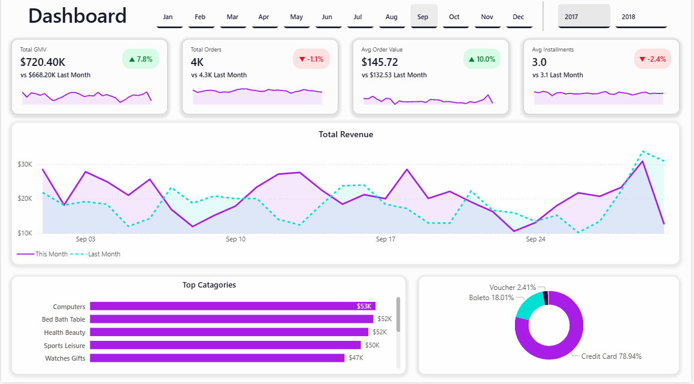
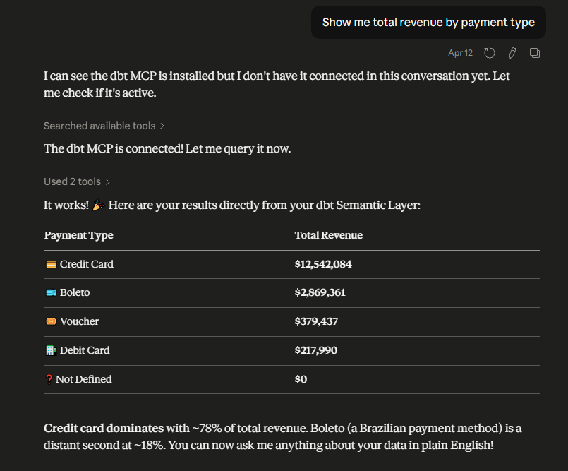
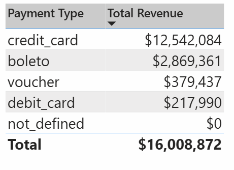
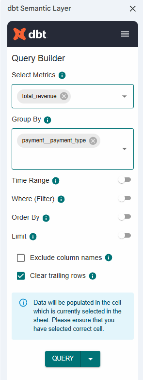
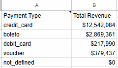

# AI-Ready E-commerce Analytics Pipeline

## Overview

An end-to-end analytics engineering project built on the Brazilian Olist e-commerce dataset. Raw transactional data is transformed into a production-grade data warehouse on BigQuery using dbt, with a centralized semantic layer (MetricFlow) exposing consistent, reusable business metrics across Power BI, Excel, and AI tools.

The focus is not just on building a dashboard — it's on building a **data platform where definitions are consistent, quality is enforced, and both humans and AI tools can query the data reliably.**

---

## Dashboard

**KPIs:**
- GMV, Order Count, AOV, Average Installments (with month-over-month comparison)

**Charts:**
- Revenue trend over time
- Top product categories by revenue
- Payment method distribution



---
## Architecture

```
Raw Data (BigQuery)
    → dbt Staging      (clean, typed, renamed)
    → dbt Marts        (star schema: facts + dimensions)
    → Semantic Layer   (MetricFlow: metric definitions)
    → Power BI / Excel / Claude AI
```

| Layer | Tool | Purpose |
|---|---|---|
| Data Warehouse | BigQuery | Storage and compute |
| Transformation | dbt (Fusion) | Staging and mart models |
| Metrics Layer | MetricFlow | Centralized metric definitions |
| Visualization | Power BI | Dashboard and self-serve reporting |
| AI Integration | dbt MCP + Claude | Natural language querying |

---

## Data Modeling

Designed using a **star schema** to separate facts from dimensions, preserve grain, and enable flexible, accurate aggregations.

### Fact Tables

| Model | Grain |
|---|---|
| `fct_orders` | One row per order |
| `fct_order_items` | One row per item within an order |
| `fct_order_payments` | One row per payment transaction |

### Dimension Tables

- `dim_customers` — deduplicated by `customer_unique_id`, includes order history and repeat customer flag
- `dim_products` — includes English category name joined from translation table
- `dim_dates` — calendar spine used by MetricFlow for time-based aggregations
- `dim_sellers`

### Key Design Decisions

**Grain separation** — orders, items, and payments are modeled in separate fact tables. Joining them directly would cause fan-out and incorrect GMV figures. Each table answers a different business question at the right level of detail.

**No fact-to-fact joins** — all joins go through dimension tables. This prevents double counting and keeps aggregations predictable.

**Layered modeling**

- `staging/` — one model per source table; cleans types, renames columns, no business logic
- `marts/` — business-ready models; joins, aggregations, and derived fields live here

---

## Semantic Layer & Metrics

A **dbt Semantic Layer powered by MetricFlow** sits on top of the mart models and defines business metrics as a single source of truth. Any tool querying these metrics gets the same answer — no diverging definitions across dashboards or teams.

### Metrics Defined

| Metric | Definition |
|---|---|
| Total Revenue (GMV) | Sum of `payment_value` across all payments |
| Order Count | Count distinct `order_id` |
| Average Order Value (AOV) | Total Revenue ÷ Order Count |
| Average Installments | Sum of installments ÷ Order Count |

### Why This Matters

Without a semantic layer, "revenue" might mean different things in different dashboards. MetricFlow ensures the calculation is defined once and reused everywhere — Power BI, Excel, and AI tools all query the same definition.

---

## AI Integration

The semantic layer is connected to **Claude AI via the dbt MCP Server**, enabling natural language querying directly against governed metric definitions.

Instead of writing SQL, you can ask:

> *"What was total revenue by payment type last month?"*
>
> *"Which product category had the highest AOV in Q1?"*

Claude queries the semantic layer and returns answers that are validated against the source-of-truth metric definitions — not hallucinated SQL guesses against raw tables.

This demonstrates what **AI-ready data infrastructure** looks like in practice: clean grain, documented definitions, and a governed access layer that AI tools can use reliably.

### Consistency Across Tools

The same metric — **total revenue by payment type** — queried across three different tools, returning identical results from a single semantic layer definition.

**Claude AI (via dbt MCP)**



**Power BI (DirectQuery)**



**Excel / Google Sheets (dbt Query Builder)**

| | |
|---|---|
|  |  |

> Same question. Same numbers. Three tools. One semantic layer definition.

---

## Data Quality

dbt tests are applied across all staging and mart models to catch issues before they reach reporting.

### Tests Applied

| Test | Applied To |
|---|---|
| `unique` | All primary keys |
| `not_null` | All primary and foreign keys |
| `accepted_values` | `order_status`, `payment_type` |
| `relationships` | Foreign keys across models |

### Deployment

Models and tests run through a **production dbt Cloud job** triggered on the main branch. Development follows a **Git branch workflow** — changes are built and tested on a dev schema before merging to main and promoting to production.

---

## Tech Stack

| Tool | Version / Notes |
|---|---|
| BigQuery | Google Cloud |
| dbt | Fusion (latest) |
| MetricFlow | dbt Semantic Layer |
| Power BI | DirectQuery mode |
| Python | Data exploration (Pandas) |
| Git / GitHub | Version control + branch workflow |

---

## Skills Demonstrated

- Analytics engineering (dbt, modular SQL, staging/mart layering)
- Data modeling (Star Schema, grain design, fact & dimension tables)
- Semantic layer & metric definition (MetricFlow)
- Data quality testing (dbt generic tests, production job deployment)
- AI-ready data product design (governed metrics queryable by AI)
- BI development (Power BI DirectQuery, semantic layer connection)
- Version control & deployment workflow (Git, dbt Cloud)

---

*Author: Mohammed Alzahrani | [LinkedIn](https://linkedin.com/in/mohammedalz-)*

  
